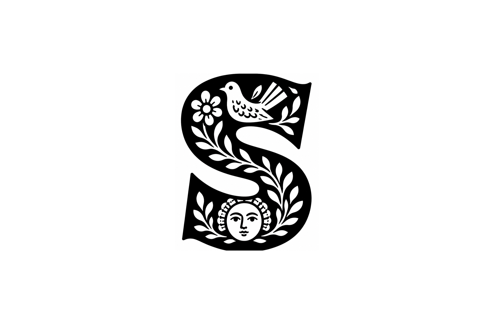

# Skaz

> Voice and clipboard screenshots, merged into one Markdown.



Records your voice while you narrate something on screen, captures every screenshot you take into the clipboard, and merges them into a single Markdown file with each screenshot placed at the moment it was taken. Everything stays on your Mac — transcription runs locally via Parakeet TDT v3 multilingual (~25 European languages including English, Russian, German, Spanish, etc.).

## How it works

You speak. The mic records mono 16 kHz audio. Every time you press `cmd+ctrl+shift+4` or use CleanShot or anything else that puts an image in your clipboard, Skaz catches it and tags it with the current timestamp. When you stop, the wav runs through Parakeet locally, the sentences come back with start and end times, and screenshots are woven into the transcript at the moments they happened.

The output is one folder per session:

```
~/Documents/skaz-sessions/<name>/
├── notes.md           # transcript with screenshots placed by time
├── transcript.txt     # raw transcript with [start → end] timecodes
├── audio.wav          # the original recording
└── screenshots/
    ├── 01_00-12.png
    ├── 02_00-45.png
    └── 03_01-08.png
```

`notes.md` looks like:

```markdown
# homepage-review

Recorded: 2026-05-03T14:22:00
Duration: 03:47
Screenshots: 3

---

**[00:00]** I'm looking at the current homepage. The spacing on the
hero feels too tight. The CTA is fighting with the headline.


*screenshot at 00:12*

**[00:18]** This is the old version we shipped last month. The
breathing room around the headline was much more generous.
```

## Install (via Claude Code)

Skaz installs itself by handing the install instructions to Claude Code. No installer GUI, no manual config.

```bash
git clone https://github.com/ryadovoys/skaz
cd skaz
claude
```

Then in Claude Code, say: **"install this"**

Claude reads `INSTALL.md`, asks a few setup questions (where to save sessions, download the model now or later, auto-start at login, hotkey, optional companion skill), runs the install, verifies. After that, Skaz is a normal Mac menu-bar app — Claude is no longer in the loop.

## Use

Click `S` in your menu bar — or hold the global hotkey (default `Right Option + Right Shift`):

- **Start session** → recording begins, the icon flips from a square to a circle
- Talk while looking at the screen. Screenshot anything you want anchored to the timeline.
- **Stop session** → name the session (or hit Enter to keep auto-name) → wait for transcription
- Notification → click "Open last session" to read the result

Each session is its own folder. Drag `notes.md` into a Claude conversation and you have rich case-study material with images woven in by time.

Stop a stuck session from the terminal:

```bash
skaz stop
```

## What you can do with the output

1. **Build case studies.** Talk through a project naturally, screenshot anything you want to show. Drop the result into Claude and ask for a case study — the LLM has both the story and the visuals as context, can write the page and place the images.
2. **Capture feedback.** Walk through a design, comment on what catches you, screenshot the moments you want flagged. Export as a deck or send the whole folder.
3. **Give an LLM rich context.** Text alone is a thin slice. Text + visuals anchored by time is a much fuller picture of what you were thinking.

## Requirements

- Apple Silicon Mac (M1+)
- macOS 14+
- Python 3.11–3.13
- Microphone permission (granted on first session)
- Accessibility permission (only if you use the global hotkey)
- Claude Code for the install step — [download](https://claude.com/claude-code)

## What it doesn't do

- No cloud sync (sessions are local files)
- No video or screen recording — clipboard images only
- No multi-speaker diarization (single-mic dictation only)
- No in-app transcript editor — open `notes.md` in your editor

## Acknowledgments

- [Parakeet TDT 0.6B v3](https://huggingface.co/nvidia/parakeet-tdt-0.6b-v3) by NVIDIA
- [parakeet-mlx](https://github.com/senstella/parakeet-mlx) — Apple MLX port
- [rumps](https://github.com/jaredks/rumps) — menu-bar plumbing

## License

MIT — see [LICENSE](./LICENSE).
